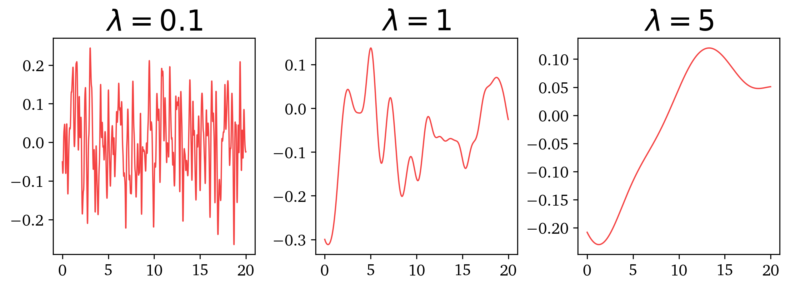
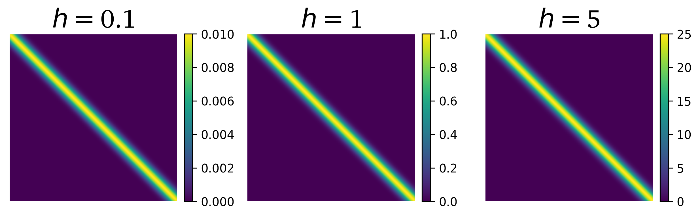

# GPR with george

## Squared Exponential covariance kernel - the meaning of hyperparameters

We explore graphically how changing hyperparameters for the squared exponential kernel affects the covariance matrix. The shape of the realisations drawn from a multivariate distribution based on the given covariance matrix is presented.

### Effect of changing `lambda` - kernel width

### Effect of changing `h` - scaling factor

