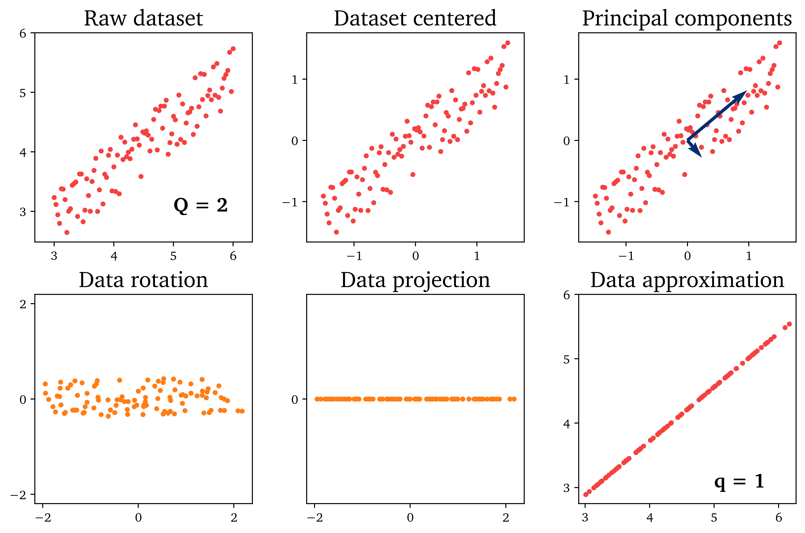

# Principal Component Analysis (PCA)

[](https://creativecommons.org/licenses/by-nc-sa/4.0/)

This repository is licensed under the [Creative Commons Attribution-NonCommercial-ShareAlike 4.0 International](https://creativecommons.org/licenses/by-nc-sa/4.0/) (CC BY-NC-SA 4.0) [license](https://creativecommons.org/licenses/by-nc-sa/4.0/legalcode).

### Download the [`PCA tutorial`](https://github.com/camillejr/ulb-atm-phd/raw/master/PCA/PCA.pdf).

### Code for the PCA tutorial can be accessed [`here`](https://github.com/camillejr/ulb-atm-phd/tree/master/PCA/PCA-tutorial.ipynb).

## PCA in Matlab

```Matlab
% PCA of a data set X:

[PCs, PC_scores, eigenvalues, tsquared, variance_explained, mu] = pca(X)
```

## PCA in Python

```Python
from sklearn.decomposition import PCA

# PCA of a data set X:

pca = PCA()
pca.fit(X)
PC_scores = pca.transform(X)
PCs = pca.components_
eigenvalues = pca.explained_variance_ratio_
```

## PCA in pictures



