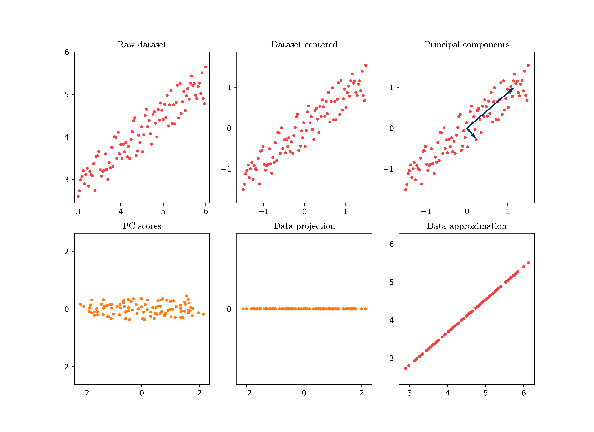

# Principal Component Analysis (PCA)

This repository is licensed under the [Creative Commons Attribution-NonCommercial-ShareAlike 4.0 International](https://creativecommons.org/licenses/by-nc-sa/4.0/) (CC BY-NC-SA 4.0) [license](https://creativecommons.org/licenses/by-nc-sa/4.0/legalcode).

## PCA in Matlab

```Matlab
% PCA of a data set X:

[PCs, PC_scores, eigenvalues, tsquared, variance_explained, mu] = pca(X)
```

## PCA in Python

```Python
# PCA of a data set X:

pca = PCA()
pca.fit(X)
PC_scores = pca.transform(X)
PCs = pca.components_
eigenvalues = pca.explained_variance_ratio_
```

## PCA in pictures



