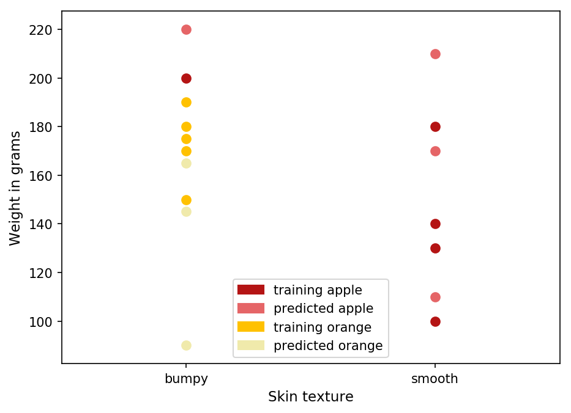

# Apples and oranges

https://www.youtube.com/watch?v=kXuypU4qjj8

This is a [DecisionTreeClassifier](https://scikit-learn.org/stable/modules/generated/sklearn.tree.DecisionTreeClassifier.html) of two very strange fruits that have the following characteristics:

- oranges weight less than about 200 grams and their skin is bumpy

- apples that have a smooth skin typically weight less than about 180 grams but when their mass exceeds 200 grams their skin can get bumpy

