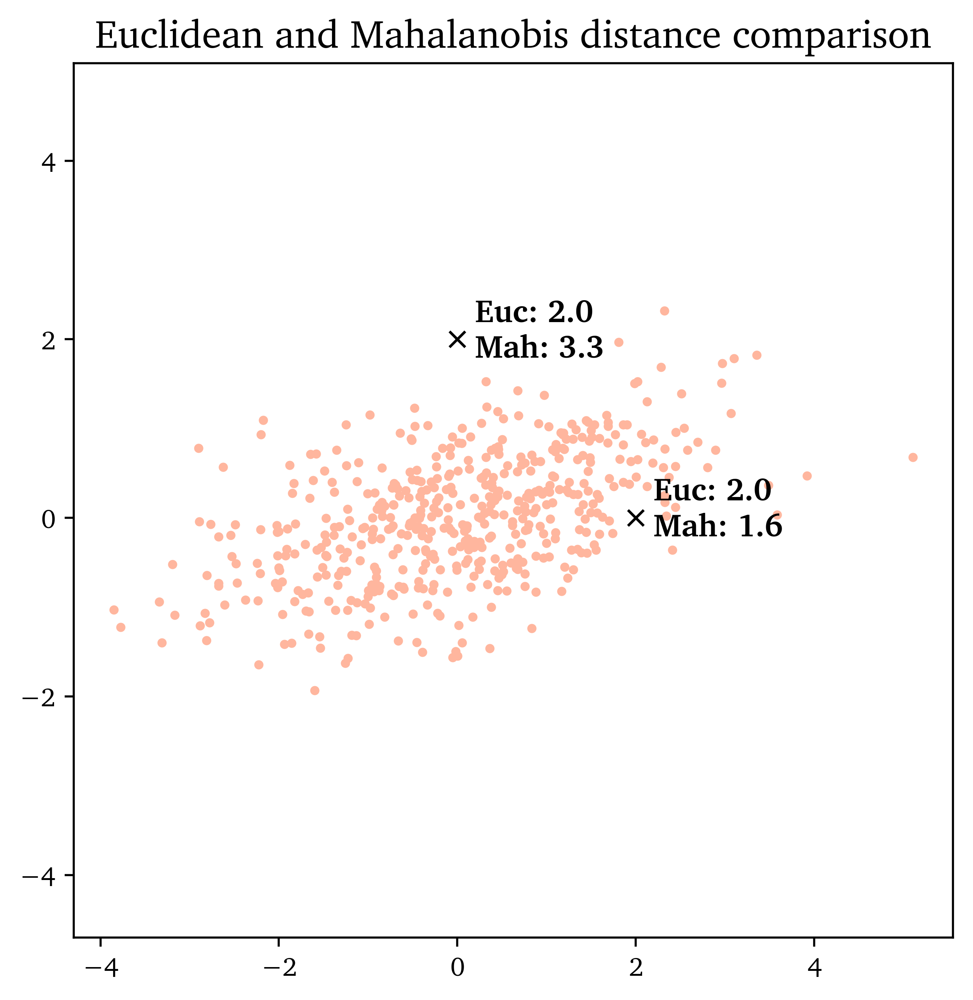

# Mahalanobis distance

Mahalanobis distance metric takes into account the covariance between random variables.

## Demo

In this demo, a 2D data set is generated from a multivariate normal distribution:

```python
x, y = np.random.multivariate_normal(mean, covariance, 500).T
```

with a prescribed `mean` and a non-zero, non-diagonal `covariance` matrix.

Two points were then artificially selected: `(0, 2)` and `(2, 0)` that have the same Euclidean distance from the `mean`.

If clustering was done based on Euclidean distance, both points would belong to the given data cluster on equal rights.

However, due to covariance in this data set, it is clearly visible that the point `(2, 0)` belongs to this cluster _more_ than the point `(0, 2)`. Computing the Mahalanobis distance helps us break the ties.



## References

> C.M. Bishop - Pattern Recognition and Machine Learning
> 
> http://mccormickml.com/2014/07/22/mahalanobis-distance/
