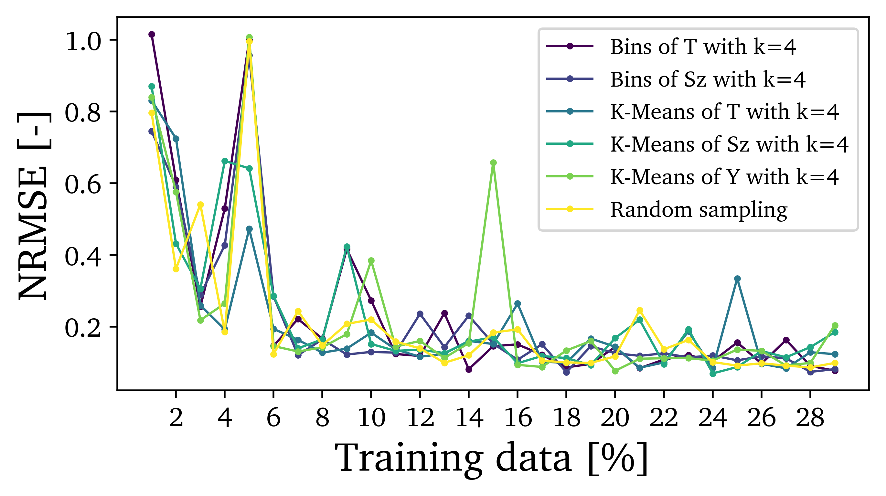

# The effect of training data selection on the regression performance using Neural Networks

## Effect of various training data selection methods and training percentage

We used K-Means clustering, variable bins clustering and random selection. The training percentage is the percentage of the total data that was used for training. The NRMSE is computed on the remainging test data.

## Effect of number of clusters
