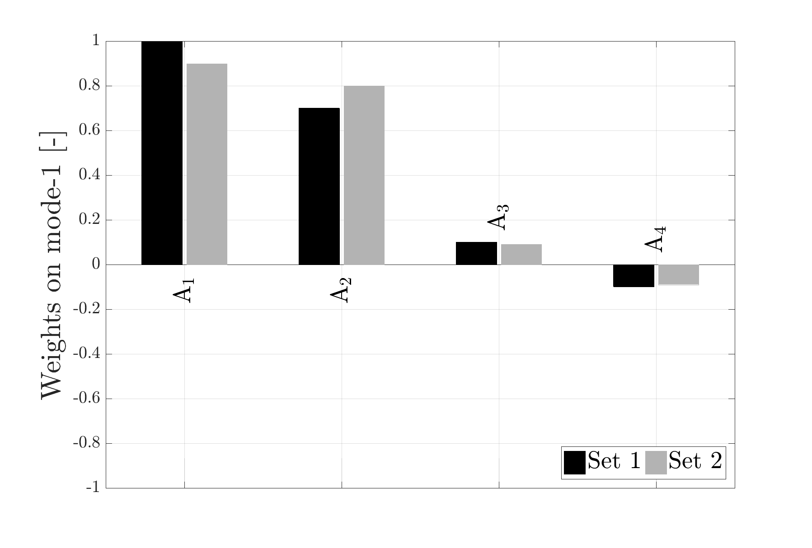

# `bar` plot of eigenvalue weights

## Example plotting with function `plot_eigenvalue_weights_bar_plot()`

```matlab
clc, clear all, close all
data_aliases = {'Set 1', 'Set 2'};
variables = {'$\rm{A_1}$', '$\rm{A_2}$', '$\rm{A_3}$', '$\rm{A_4}$', '$\rm{A_5}$'};
colors = [
[0 0 0 ] % black
[0.7 0.7 0.7] % light gray
];
A = [1; 0.7; 0.1; -0.1; 0.4;
    0.9; 0.8; 0.09; -0.09; 0.45];

plot_eigenvalue_weights_bar_plot(A, 2, 1, 'mode', variables, data_aliases, colors, 'example');
```


